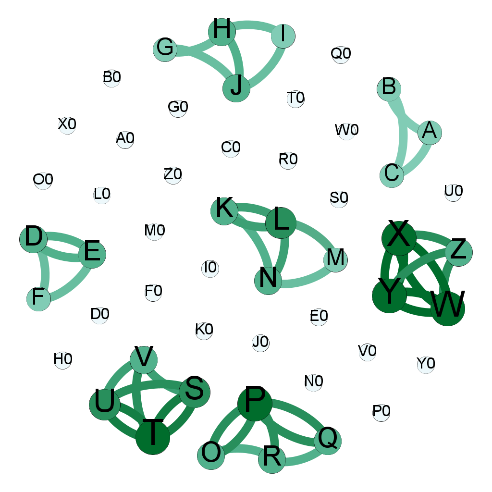

# Introduction

This repository contains the source code of the simulation system mentioned in the paper **"AlertInsight: Mining Multiple Correlation For Alert Reduction"**. 

The simulation system can flexibly simulate diverse correlations of modules according to the configuration. 
Each module can have a certain probability of independent failure. 
It is due to the correlations that modules may not only fail independently, 
but may also be implicated by the correlated modules, 
leading to correlated failures. 
The simulation system implements a monitoring mechanism that detects faults and generates alert events when the modules fail. 

# Environment Requirements

* Java 1.8 or higher.
* Elasticsearch 5.0 or higher.

# Build

```
mvn clean package
```

# Run

```
java -jar <jar-name> simulation.App
```

# Example Configuration

## config.properties

```properties
#The path of work directory 
work.dir=<path> 
#The file describes the correlations.
work.input.structure-file=structure.json
#The output index in Elasticsearch.
simulation.out.index.name=<index name in Elasticsearch>
#Time span (unit=day)
simulation.duration=28
#Starting time
simulation.time.base=<timestamp>

#Elasticsearch hosts addresses
experiment.es.host=<hosts>
experiment.index.name=<index-name>

#Parameters of Episodes 
experiment.timewindow=900
experiment.timewindow.split=0.7

#Parameters of Outliers Detection
experiment.outlier.kn=5
experiment.outlier.threshold=7.5
```

## structure.json

```
[
    {
        "name": "A",
        "properties": {
            "in": [],
            "out": [
                "C",
                "B"
            ],
            "union-in": [],
            "faultProbability": 0.0001
        }
    },
    {
        "name": "B",
        "properties": {
            "in": [
                {
                    "name": "A",
                    "prob": 0.001
                }
            ],
            "out": [
                "C"
            ],
            "union-in": [],
            "faultProbability": 0.0001
        }
    },
    {
        "name": "C",
        "properties": {
            "in": [],
            "out": [],
            "union-in": [
                "A",
                "B"
            ],
            "faultProbability": 0.0001
        }
    },
    {
        "name": "D",
        "properties": {
            "in": [
                {
                    "name": "E",
                    "prob": 0.001
                }
            ],
            "out": [
                "E",
                "F"
            ],
            "union-in": [],
            "faultProbability": 0.0001
        }
    },
    {
        "name": "E",
        "properties": {
            "in": [
                {
                    "name": "D",
                    "prob": 0.001
                }
            ],
            "out": [
                "D",
                "F"
            ],
            "union-in": [],
            "faultProbability": 0.0001
        }
    },
    {
        "name": "F",
        "properties": {
            "in": [],
            "out": [],
            "union-in": [
                "D",
                "E"
            ],
            "faultProbability": 0.0001
        }
    }
]
```

# Other Notes

In addition to monitoring data, the simulation system will generate a file describing the correlations.
The file is in the format of **GEXF**, and it can be visualized by **Gephi**, which looks like below. 

<!--  -->

